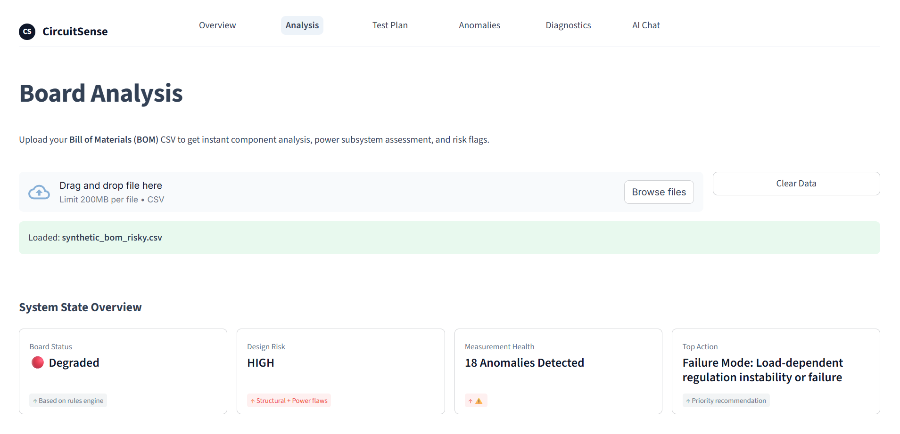
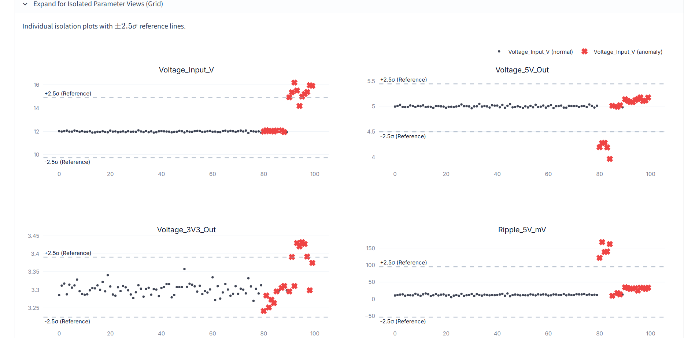
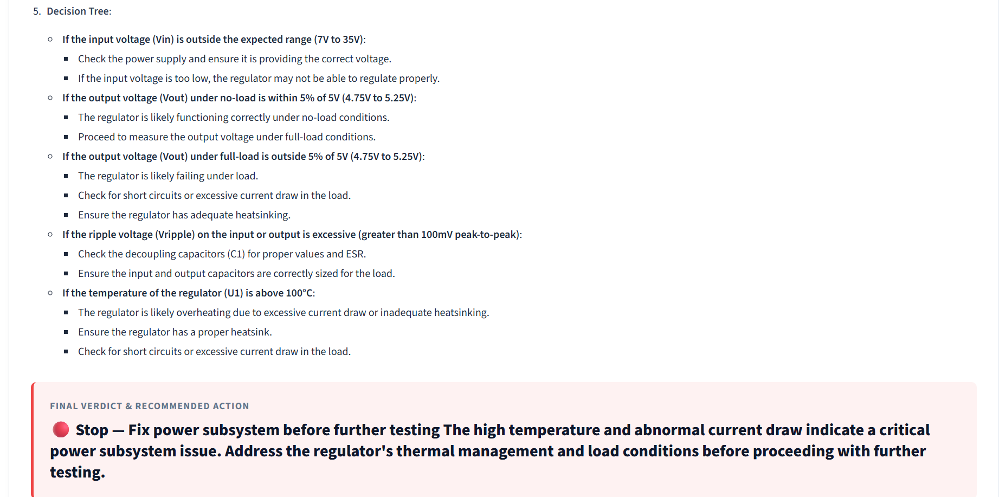

# CircuitSense: AI-Powered Hardware Diagnostic System


🔗 **Live Demo:** [https://circuitsense.streamlit.app](https://circuitsense.streamlit.app)

CircuitSense is an "Expert System" designed to accelerate hardware engineers during PCB bring-up and failure analysis. Instead of manually cross-referencing thousands of voltage logs against thermal drift, CircuitSense automates the entire ingestion, statistical analysis, and diagnostic pipeline.

## 📸 Application Preview

### 1. Board Analysis (BOM Ingestion & Risk Scoring)


### 2. Anomaly Detection (Isolation Forest)


### 3. AI Fault Diagnosis (Expert Synthesis)


## 🧩 Problem

Hardware bring-up and failure analysis require engineers to manually inspect thousands of voltage measurements, thermal logs, and test results.

This process is slow, repetitive, and heavily dependent on expert intuition.

CircuitSense automates this process by combining:
- **Deterministic engineering rules** tailored to specific board topologies.
- **Statistical anomaly detection** to mathematically isolate faults.
- **AI-assisted diagnostic reasoning** to synthesize data and recommend physical test steps.

## 🏗️ System Architecture

CircuitSense follows a layered reasoning architecture:

1. **BOM Parser**  
   Extracts board topology and power-critical components via a "Power-First" heuristic parsing engine.
2. **Rule Engine**  
   Applies deterministic electronics heuristics to generate prioritized failure modes and physical test plans.
3. **ML Anomaly Engine**  
   Uses Isolation Forest with a **Multivariate Gaussian Tail Population Test** to achieve near 100% false-positive suppression on healthy boards without needing labeled failure data.
4. **Correlation Engine**  
   Detects non-linear physical relationships (like exponential thermal drift causing voltage drop) using Spearman Rank Correlation.
5. **AI Diagnostic Engine**  
   Uses an LLM (Mistral Large) constrained by a rigid context architecture. It receives the structured board state, anomalies, and correlations to generate grounded, explainable diagnostic recommendations, eliminating hallucinations.

## 🚀 Key Features

*   **Zero-Shot Telemetry Ingestion:** Upload CSVs of raw sensor data directly from oscilloscopes or DAQs. No data cleaning or labeling required.
*   **"Power-First" Test Generation:** Automatically prioritizes testing of linear regulators and switching converters, mimicking human electronics expertise.
*   **Fully Explainable AI:** Mistral is not used as a guessing engine; it is used as a synthesizer. Every output is anchored to the deterministic mathematical models calculated in the prior steps. 

## 📂 Project Structure

```text
CircuitSense
│
├── engine/          # Rule engine, anomaly detection, correlation, LLM client
├── pages/           # Streamlit UI pages (Test Plan, Fault Diagnosis, etc.)
├── docs/            # Screenshots and project documentation
├── app.py           # Main Streamlit application entry point
├── nav.py           # Sidebar navigation routing
└── requirements.txt
```

## 🛠️ Tech Stack

*   **Frontend UI:** Streamlit (Minimalist Styling)
*   **Machine Learning:** Scikit-Learn (Isolation Forest), Pandas, NumPy, SciPy (Spearman Correlation)
*   **LLM Engine:** Mistral Large AI via API
*   **Data Visualization:** Plotly

## ⚙️ Installation & Setup

1.  **Clone the Repository:**
    ```bash
    git clone https://github.com/sriharinikeshss/CircuitSense.git
    cd CircuitSense
    ```

2.  **Install Dependencies:**
    ```bash
    pip install -r requirements.txt
    ```

3.  **Add your API Key:**
    Create a `.env` file in the root directory and add your Mistral API key:
    ```toml
    MISTRAL_API_KEY="your_api_key_here"
    ```

4.  **Run the Application:**
    *(Note: Using `python -m` ensures the app runs correctly on Windows systems without PATH issues).*
    ```bash
    python -m streamlit run app.py
    ```

## 🧠 Why We Didn't Use Deep Learning

Deep Learning requires thousands of labeled examples of broken boards. In the real world of hardware manufacturing, a 99% yield means broken boards are incredibly rare. 

Isolation Forest is an **unsupervised** algorithm—it doesn't need to know what a "broken" board looks like. It only needs to know what a "normal" board looks like, and it mathematically isolates anything that deviates. Most importantly, it is highly explainable. Engineers can see *why* a board failed, instead of trusting a Deep Learning algorithmic black box.

## 👥 Mission & Authors

CircuitSense was architected to solve the manual bottleneck in hardware bring-up. By fusing deterministic engineering rules with statistical ML and constrained language models, we aim to accelerate modern PCB diagnostics.

**Core Architecture & Engineering Team:**
*   **Sri Hari Nikesh S S**
*   **P Keerthinath**
*   **Mohamed Rayhan S**

## 📄 License

This project is open-sourced under the MIT License - see the [LICENSE](LICENSE) file for details.
